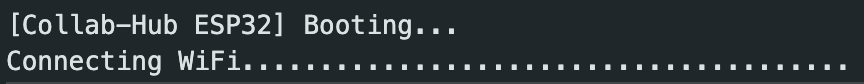
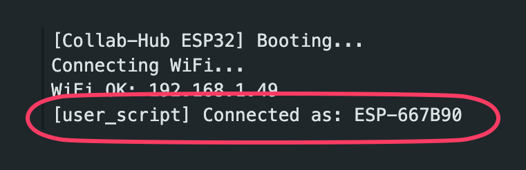
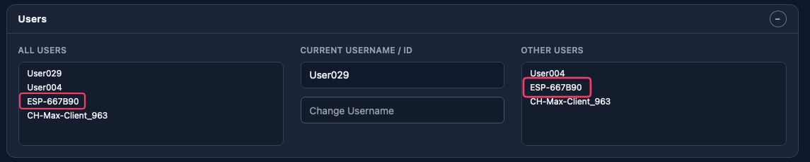
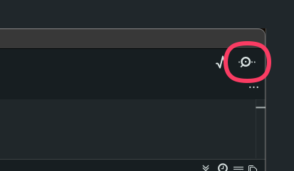
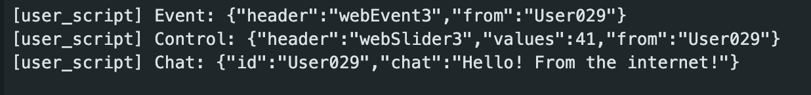
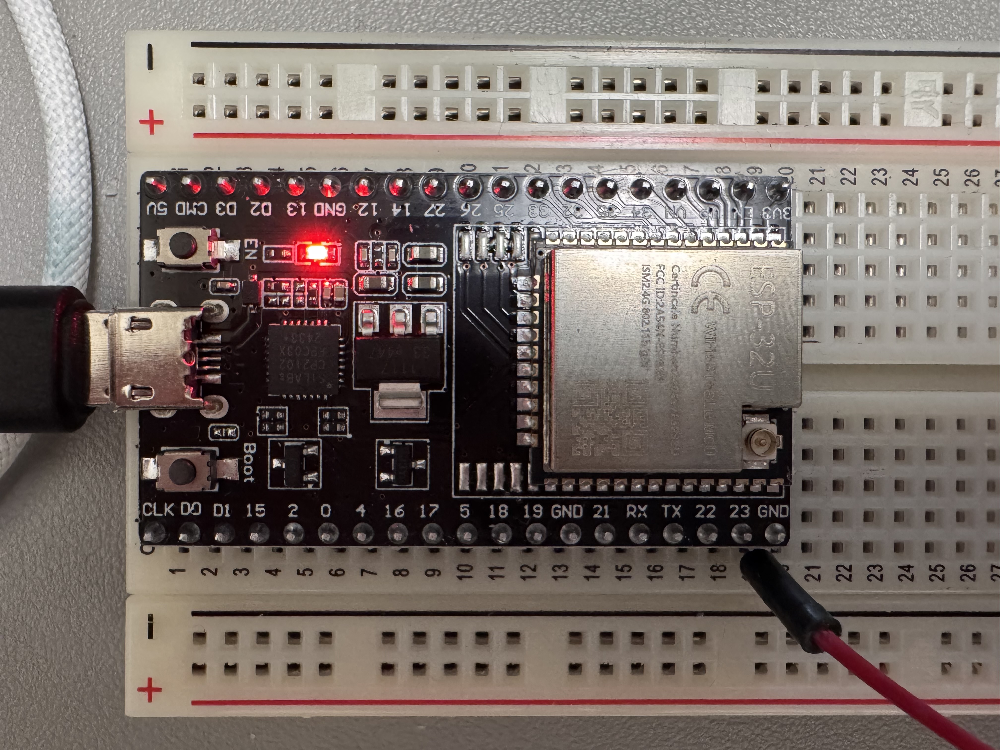
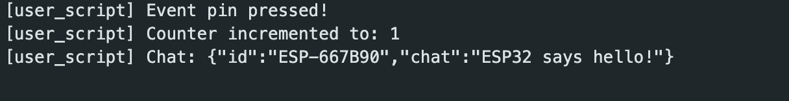
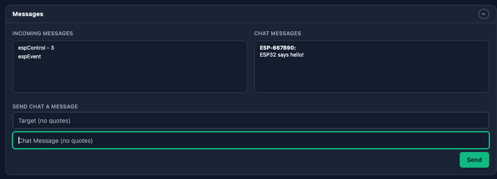

# Collab-Hub ESP32 Client - 0.1.1

This ESP32 sketch connects to a `Collab-Hub` server over WebSockets (Socket.IO framing), generates with a username starting `ESP-XYZ`, joins the `iot` room, and it able to send and receive Collab-Hub Control, Event, and Chat messages.

## Features

- Connects to Collab-Hub via ws:// or wss:// (TLS)
- Joins a room and identifies as ESP-XYZ
- Sends/receives control, event, and chat messages
- Modular: user logic in `user_script.cpp`, config in `config.h`

## File Structure & Where to Edit

- `CollabHubESP32/CollabHubESP32.ino`: Core logic (do not edit for normal use)
- `CollabHubESP32/config.h`: **Edit for WiFi, server, and room settings**
- `CollabHubESP32/user_script.cpp` & `.h`: **Edit for your custom logic, handlers, and hardware code**
- `CollabHubESP32/SioClient.*`, `WsClient.*`: Protocol internals (do not edit)
- `platformio.ini`: PlatformIO build config

<br />

# Get Started

## Arduino IDE

0. Download this repo to your computer and unzip.
1. Install ESP32 core: Tools → Board → Boards Manager → search "esp32" by Espressif Systems → Install
2. Open the sketch folder: `CollabHubESP32`
3. Install ArduinoJson library (v6) via Tools → Manage Libraries…
4. Edit `config.h` for WiFi and hub settings (in the `CollabHubESP32` folder) - Details below
5. Select your board and correct `/dev/cu.*` port - Troubleshooting tips below
6. Upload and open Serial Monitor at 115200 baud

<br />

# Arduino unable to connect to your ESP32 Board?

Your computer might have trouble recognizing your board. Double check the following:

1. _Not all cables are created equal_. Make sure the ESP32 board is connected to your computer through a data cable, as some cables are just charging cables and may not have their data nodes connected.
2. If you're on a Mac, you might need to install drivers:

   - CP210x: https://www.silabs.com/developers/usb-to-uart-bridge-vcp-drivers
   - CH34x: https://www.wch.cn/downloads/CH34XSER_MAC_ZIP.html

   - If you are installing drivers, unplug your board before install. Make sure you Allow these drivers in MacOS. You might see an alert window pop-up. In other cases you will have to go to either Security & Privacy settings or Login Items & Extensions to press Allow from the drivers. Reboot.

## List Serial Ports (macOS/Linux)

```bash
# macOS Terminal
ls /dev/cu.*
# Linux Terminal
ls /dev/ttyUSB*
ls /dev/ttyACM*
```

**Typical ESP32 ports:**

- `/dev/cu.SLAB_USBtoUART` (CP210x)
- `/dev/cu.wchusbserial*` (CH34x)
- `/dev/ttyUSB0` or `/dev/ttyACM0` (Linux)

---

## Configuring the WIFI and server location

Edit `CollabHubESP32/config.h`:

- `WIFI_SSID` / `WIFI_PASS`
- `HUB_HOST` / `HUB_PORT` (use your hub IP; non-TLS `ws://`)
- `HUB_NAMESPACE` (typically `/hub`)
- `IOT_ROOM` (default `iot`)

The values you want to change are the `WIFI_SSID` and `WIFI_PASS` in `config.h`.
The other values do not need to change.

## Connect

1. After you have customized your `WIFI_SSID` / `WIFI_PASS` in `CollabHubESP32/config.h`, upload the sketch to the board using ArduineIDE.
2. The board should restart and try to connect to your WIFI.

   - 

   - ^ Successful WIFI Connection Serial Printout within ArduinoIDE

   - 

   - ^ UNSuccessful WIFI Connection Serial Printout within ArduinoIDE will continue to extend the ellipses.......

3. After connecting to your WIFI, the ESP32 will try to connect to the Collab-Hub server. The URL/destination of Collab-Hub server is a value set at `HOST-HUB` in `CollabHubESP32/config.h`. For testing and general purposes, you will not have to change this.

   

   The image above show the Serial printout within the ArduinoIDE. This message is a customizable message called as an OnConnection event.

4. You can check your connection to the Collab-Hub server with the Collab-Hub webclient (http://server.collab-hub.io) and see the ESP32-[username].

   

5. CONGRATULATIONS! You are connected to the Collab-Hub Server.

## Sending and Receiving Data through Collab-Hub

### Receiving Messages to the ESP32

1. If the ESP32 is connected to the ArduinoIDE, you can see the serial readout of incoming messages.
   

2. Open a browser window of the Collab-Hub Webclient (https://server.collab-hub.io) and click the 'event webEvent3' or slide the 'control webSlider3' UI elements. These two messages are 'PUSH ALL' type and targets, which means these messages go all users in the namespace, and the ESP32 should receive them automatically. You can type a chat message as well from the Webclient-- set the target 'all' (no quotes) or the username of your ESP32.

   

3. After you clicked and used the slider, look back at the Arduino Serial Monitor window. You should see similar printouts like the image below:
   

   You should see the Event and Control information. Every Collab-Hub message has a `Header`, a `From`, and sometimes a `Value` portion to the messages.

### Sending Messages from the ESP32

1. In the existing, you can send all three types of messages being using the GPIO.
2. We'll cover triggering those messages and then dive into the code structure and how you might edit the code for your purposes.
   
3. Currently, the user_script is set to trigger messages when GPIO pins are connected to ground.
   1. GPIO 0 - send an event `espEvent`
   2. GPIO 4 - increment an integer, send that integer as a control message with header `espControl`
   3. GPIO 16 - increment the integer, send that integer as a control message with header `espControl`
   4. GPIO 17 - send a chat message
4. You should be able to connect the individiual pins to Ground and should see a Serial printout in the ArduinoIDE
   
5. You should be able to see the event, control values, and chat appear at the top to the Webclient.
   

```
# Wiring:

1. Connect one side of a pushbutton to the selected GPIO pin (e.g., GPIO 0).
2. Connect the other side of the button to GND.
3. The pin is set as INPUT_PULLUP, so pressing the button pulls it LOW and triggers the event.
```

## Customizing your own logic

You can change most of this script run your own logic. Most those files do not need to change, but understanding the Setup and Loop structure will help you structure your usage.

```cpp
Summary of Execution Order

CollabHubESP32.ino
|-(Boot)
|-(Setup)
|-userScriptSetup() (user_sript.cpp)
|-WIFI Setup and Connect (config.h)
|-Collab-Hub Connect (SioClient.cpp/.h)
|--Set Username
|--Join 'iot' room
|--Subscribe to all Events and all Control
|--Establish Event, Control, Chat message handlers
|
|-(Loop)
|	|-Connection/Heartbeat maintainance
|	|-userScriptLoop() user_sript.cpp
|___|
```

## user_script.cpp

The first section of the file shown below should not be changed and setup the shape of messages to send to the server. You can change most of the other code beneath that. You can change the content of `userScriptSetup()` and `userScriptLoop()`, do not remove these functions completely.

```cpp
#include "SioClient.h"
#include "user_script.h"
#include <ArduinoJson.h>
extern SioClient sio;

// ================= USER MESSAGE EMITTERS (Don't Edit)=================

void emitControl(const char *header, float value, const char *mode, const char *target)
{
    StaticJsonDocument<256> doc;
    doc["header"] = header;
    doc["values"] = value;
    doc["mode"] = mode;
    doc["target"] = target;
    String s;
    serializeJson(doc, s);
    sio.emit("control", s.c_str());
}

void emitEvent(const char *header, const char *payload)
{
    StaticJsonDocument<256> doc;
    doc["header"] = header;
    doc["mode"] = "push";
    doc["target"] = "all";
    if (payload && strlen(payload) > 0)
    {
        doc["payload"] = payload;
    }
    String s;
    serializeJson(doc, s);
    sio.emit("event", s.c_str());
}

void emitChat(const char *text)
{
    StaticJsonDocument<128> doc;
    doc["chat"] = text;
    doc["mode"] = "push";
    doc["target"] = "all";
    String s;
    serializeJson(doc, s);
    sio.emit("chat", s.c_str());
}
```

---

# Troubleshooting

- No serial ports: Install USB driver, allow extension, reboot, replug board
- Upload stalls: Hold BOOT, tap EN (RST), release BOOT during connection
- Wrong port: Set `--upload-port` or select correct port in IDE
- Hub not receiving: Check WiFi, IP, and port settings
- TLS errors: use non-TLS `ws://` or provide CA certs for `wss://` support
- Upload stalls: Hold BOOT, tap EN (RST), release BOOT during connection.
- Hub not receiving: Check WiFi, IP, and port settings.

---

## Advanced: Connection & Transport

This ESP32 client supports both unencrypted (`ws://`) and encrypted (`wss://`, TLS) WebSocket connections to Collab-Hub servers.

- **TLS/SSL (wss://) is fully supported** using `WiFiClientSecure`. By default, the config uses `wss://server.collab-hub.io` (port 443, `USE_TLS true`).
- For local or non-TLS servers, set `USE_TLS false` and use the appropriate `HUB_HOST` and `HUB_PORT` (e.g., `ws://192.168.1.100:3000`).
- No CA certificate is required for the public server; the client uses `setInsecure()` for convenience. For production security, you may add CA validation.
- All connection settings are in `config.h`:
  - `HUB_HOST` (server address)
  - `HUB_PORT` (443 for wss, 3000 for ws)
  - `USE_TLS` (true for wss, false for ws)
    **Default:** The client connects to `wss://server.collab-hub.io` out of the box.
    If you encounter TLS handshake issues, ensure your ESP32 board has sufficient memory and is running the latest ESP32 Arduino core. For most users, secure connections should work reliably.

---

## Links & Resources

- [server.collab-hub.io web page](https://server.collab-hub.io) — test your ESP32 client, send/receive messages in real time
- [ESP32 Arduino Core](https://github.com/espressif/arduino-esp32)

### USB Drivers (macOS)

- CP210x: https://www.silabs.com/developers/usb-to-uart-bridge-vcp-drivers
- CH34x: https://www.wch.cn/downloads/CH34XSER_MAC_ZIP.html

**Common port names:**

- `/dev/cu.usbserial-...`
- `/dev/cu.SLAB_USBtoUART`
- `/dev/cu.wchusbserial...`

If upload stalls, hold BOOT, tap EN (RST), release BOOT during connection.

**VS Code PlatformIO:**

1. Install "PlatformIO IDE" extension.
2. Open `Collab-Hub-ESP32` folder.
3. Select env `esp32dev` and use "Build" → "Upload" → "Monitor".

On serial monitor you should see:

- WiFi connected (IP address)
- Event messages sent when a button is pressed on the configured GPIO pin
- Client listens to `control`, `event`, and `chat` frames.
- Pressing a button connected to the configured GPIO pin (default: GPIO 0) sends an event

## Connection & Transport

This ESP32 client supports both unencrypted (`ws://`) and encrypted (`wss://`, TLS) WebSocket connections to Collab-Hub servers.

- **TLS/SSL (wss://) is fully supported** using `WiFiClientSecure`. By default, the config uses `wss://server.collab-hub.io` (port 443, `USE_TLS true`).
- For local or non-TLS servers, set `USE_TLS false` and use the appropriate `HUB_HOST` and `HUB_PORT` (e.g., `ws://192.168.1.100:3000`).
- No CA certificate is required for the public server; the client uses `setInsecure()` for convenience. For production security, you may add CA validation.
- All connection settings are in `config.h`:
  - `HUB_HOST` (server address)
  - `HUB_PORT` (443 for wss, 3000 for ws)
  - `USE_TLS` (true for wss, false for ws)

**Default:** The client connects to `wss://server.collab-hub.io` out of the box.

If you encounter TLS handshake issues, ensure your ESP32 board has sufficient memory and is running the latest ESP32 Arduino core. For most users, secure connections should work reliably.

## File Structure & Customization

Your project is organized for easy configuration and user extension:

- `CollabHubESP32/CollabHubESP32.ino`: **Core logic**. Do not modify unless you are changing the package itself. Handles connection, routing, and setup.
- `CollabHubESP32/config.h`: **Edit this file to set your WiFi, server, and room settings.**
- `CollabHubESP32/user_script.cpp` & `user_script.h`: **This is where you add your own logic.**
  - Implement your custom event, control, and chat handlers here.
  - Add your own methods, variables, and hardware logic in `user_script.cpp`.
  - Use the provided hooks (e.g., `onControlMessage`, `onEventPinPressed`, etc.) to respond to messages and hardware events.
- `CollabHubESP32/SioClient.h/.cpp`: Socket.IO protocol shim (do not edit unless you are modifying protocol internals).
- `CollabHubESP32/WsClient.h/.cpp`: Minimal WebSocket client (do not edit unless you are modifying protocol internals).
- `platformio.ini`: PlatformIO build configuration (if you choose to use Platform.io)

**To customize behavior:**

- Only edit `config.h` (for network/server settings) and `user_script.cpp`/`user_script.h` (for your application logic).
- You do NOT need to change `CollabHubESP32.ino`, `SioClient`, or `WsClient` for normal use.

## Arduino IDE Setup

- Install ESP32 core: Tools → Board → Boards Manager → search "esp32" by Espressif Systems → Install.
- Open the sketch folder: `/CollabHubESP32` (file name matches folder).
- Install dependencies via Tools → Manage Libraries…:
  - ArduinoJson by Benoit Blanchon (v6).
- Select your board (ESP32 Dev Module) and the correct `/dev/cu.*` port.
- Edit `/CollabHubESP32/config.h` with your WiFi and hub settings.
- Upload, then open Serial Monitor at 115200.

Notes:

- No extra Socket.IO libraries are required; the sketch includes a minimal WebSocket client (`WsClient`) and a small Socket.IO framing shim (`SioClient`).
- If your Mac shows only Bluetooth ports, install CP210x or CH34x driver, allow the system extension, reboot, and replug the board.

**Tip:** You can use the [server.collab-hub.io web page](https://server.collab-hub.io) to test your ESP32 client. This web interface lets you send and receive control, event, and chat messages in real time, making it easy to verify your device's connectivity and message handling.
